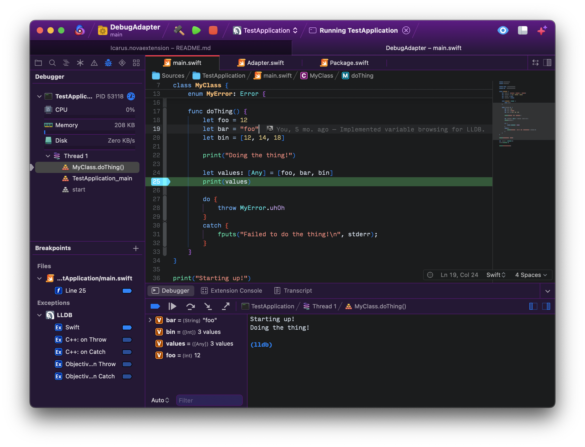

# Icarus

Icarus is a [Nova](https://nova.app) extension providing **Swift**, **C**, **C++**, and **Objective-C** language support.

## Getting Started

If you're just looking to use the Icarus extension, you can download it from the Extension Library [directly within Nova](nova://extension?id=panic.Icarus).

Icarus adds:

- 🖍️ **Syntax highlighting**, symbolication, and code folding using Tree-sitter grammars
- 🧪 **Language intelligence**, completions, issues, and more via SourceKit-LSP
- 🐛 **Debugging** via LLDB both locally and on supported remote platforms



Intelligence is provided using [SourceKit-LSP](https://github.com/apple/sourcekit-lsp) from the Swift open-source project. This language server provides support for Swift natively and uses `clangd` behind the scenes for C-family languages.

Debugging is supported using _LLDB.framework_, distributed with both Apple's Xcode tools and the standalone Swift toolchain.

The Icarus project consists of several parts:

- A Nova extension bundle
- A debug adapter written in Swift
- Five [Tree-sitter](https://tree-sitter.github.io/tree-sitter/) grammars precompiled as macOS dynamic libraries
- Custom queries for those grammars to add syntax highlighting, symbolication, code folding, etc.
- Some JavaScript code for interfacing with the Nova extension runtime

## Contributing

Submitting feedback on Icarus is welcomed via GitHub issues in this project. Please take the following considerations into account when filing or replying to issues:

- Try and be clear and concise.
- Avoid combining multiple unrelated topics into a single issue.
- When reporting issues, include step-by-step reproduction cases.
- Consider including screenshots or screen recordings when applicable.
- Include environment details, such as operating system, Nova version, toolchain version, etc.
- While casual conversation, joking, and asides are fine in threaded discussions, avoid overuse when it is not appropriate for the situation.

If you would like to contribute directly to the Icarus project, you are welcomed to clone this repository and submit pull requests with improvements and fixes.

Code contributions should be formatted in accordance and consistency with the rest of the project, which (with occasional exception) takes its styling practices from the examples of the wider Swift open-source community:

- [Swift Contribution Guidelines](https://www.swift.org/contributing/)
- [Swift API Design Guidelines](https://www.swift.org/documentation/api-design-guidelines/)
- [Swift Style Guide (third-party)](https://google.github.io/swift/)

All pull requests will be reviewed by the core team at Panic before being merged into the main branch.

## Building

Out of the box, a copy of this repository requires only that the debug adapter (`LLDBAdapter`) be built from source using Swift Package Manager and placed in the `Executables/` directory of the `Icarus.novaextension` bundle. If this is not done, everything else will work, but attempts to invoke the debugger will fail.

To build the debug adapter, you can either use the built-in Nova tasks for the DebugAdapter subproject directory or invoke SwiftPM directly:

```shell
swift build --product LLDBAdapter --configuration release
cp .build/release/LLDBAdapter ../Executables/LLDBAdapter
```

Once this is done, the extension bundle can be loaded into Nova as a development extension for testing.

## Community

Icarus is part of [Panic's](https://panic.com) open-source initiatives. We highly value the diversity of the community and encourage developers from all walks of life, skillsets, and backgrounds to contribute.

Panic is dedicated to providing a harassment-free experience for everyone, regardless of gender identity and expression, sexual orientation, disability, mental illness, neurotype, physical appearance, body, age, race, ethnicity, nationality, language, or religion. We do not tolerate harassment of participants in any form. We reserve the right to ban users from our initiatives at any time and for any reason.

If you have questions or concerns, do not hesitate to contact us via `github@panic.com`.

## Why The Name?

The Swift logo and mascot is of a diving swallow. Icarus is the name of a character from an ancient Greek legend whose father fashioned wings of feather and wax so the two might escape a prison. When Icarus flew too close to the sun, the wax melted and he fell into the sea. Swallow, wings, sea (as in "C"), and dev tools that might fly too close to the sun. Too much?

Oh, and the logo is a reference to Hades from Supergiant Games.

## Acknowledgements

The following components are or were utilized in some way or another for the Icarus project:

- [tree-sitter-c](https://github.com/tree-sitter/tree-sitter-c), for C parsing support
- [tree-sitter-cpp](https://github.com/tree-sitter/tree-sitter-cpp), for C++ parsing support
- [tree-sitter-swift](https://github.com/alex-pinkus/tree-sitter-swift), for Swift parsing support
- [tree-sitter-objc](https://github.com/jiyee/tree-sitter-objc), for Objective-C parsing support
- [tree-sitter-objcpp](https://github.com/panicinc/tree-sitter-objcpp), for Objective-C++ parsing support, itself a derivative of the tree-sitter-cpp and tree-sitter-objc projects
- [SourceKit-LSP](https://github.com/apple/sourcekit-lsp), for language intelligence
- [codelldb](https://github.com/vadimcn/codelldb), for conceptual reference on interfacing with LLDB in a debug adapter

